# Windows Privilege Escalation Lab (2024)

This repository documents a controlled lab exercise performed as part of coursework and later extended with additional self directed analysis. The lab demonstrates discovery, exploitation of a legacy SMB vulnerability, post-exploitation enumeration and evidence collection on a Windows VM. All images have been redacted to remove sensitive values and are included for educational and defensive research in authorized environments only.

## Table of Contents

- [Summary](#summary)  
- [Scope and safety](#scope-and-safety)  
- [Project content](#project-content)  
- [Key findings](#key-findings)  
- [Tools and technologies](#tools-and-technologies)  
- [High level workflow](#high-level-workflow)  
- [Project screenshots](#project-screenshots)  
  - [Environment and access](#environment-and-access)  
  - [Network discovery and exposure](#network-discovery-and-exposure)  
  - [Compromise and session](#compromise-and-session)  
  - [Host capture and evidence handling](#host-capture-and-evidence-handling)  
  - [Trace conversion and network analysis](#trace-conversion-and-network-analysis)  
- [Defensive recommendations](#defensive-recommendations)  
- [References](#references)  
- [Contact](#contact)

## Summary

This lab demonstrates how an attacker can enumerate services, exploit an exposed legacy vulnerability to gain a remote session, and collect host and network artefacts. It also shows how trace data can be extracted from the host, converted for offline analysis, and used to recover sensitive information. The material here is high level and intended to help defenders spot indicators of compromise and improve controls.

## Scope and safety

- Lab environment only. Do not reuse techniques against systems you do not own or have explicit authorization to test.  
- Screenshots have been redacted (IPs, usernames, hashes and session tokens removed).  
- This document intentionally omits step-by-step exploit commands. It focuses on observations, artefacts and defensive guidance.

## Project content

- A chronological set of screenshots documenting the exercise from initial enumeration to evidence extraction.  
- High level narrative of actions and observations.  
- Recommendations for detection, containment and remediation.

## Key findings

- Unpatched legacy services may allow remote code execution leading to full system compromise.  
- An attacker with SYSTEM privileges can create, move and delete forensic artefacts; monitoring for suspicious file activity and transfers is crucial.  
- ETL traces on Windows can be converted for network analysis and may reveal sensitive cleartext credentials if the target application lacks TLS.  
- Endpoint telemetry (process creation, command lines, file writes) combined with network captures are the most reliable path to detect and investigate such incidents.

## Tools and technologies

- Windows Server (victim lab host)  
- Kali Linux (attacker / analysis host)  
- Network and host enumeration tools, exploitation framework for lab testing (high level only)  
- Windows built-in ETW tracing (`netsh trace`) for host captures  
- etl2pcapng utility for converting ETL traces to PCAPNG  
- Wireshark for offline network analysis

## High level workflow

1. Confirm lab connectivity and collect host IP addresses for attacker and victim.  
2. Perform network and service enumeration to identify exposed services.  
3. Validate presence of a known legacy vulnerability in a safe, controlled manner.  
4. Use an appropriate test framework in the lab to gain an interactive session for analysis purposes.  
5. From the compromised host collect system information and open an interactive shell for investigation.  
6. Start a host side network trace and allow the target application to exercise the functionality of interest.  
7. Stop the trace, transfer the ETL file to the analysis host and convert it to PCAPNG.  
8. Inspect the capture for sensitive artifacts such as HTTP POST bodies, credentials or suspicious callouts.  
9. Clean up temporary artefacts and document findings.

---

## Project screenshots

> Note: image paths below use `screenshot/<filename>.png` to match the repository folder name exactly.

### Environment and access

Shows the administrative user context menu in the lab environment.  
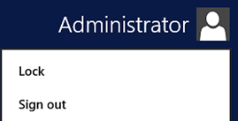

Login prompt for the utility Linux VM used during the exercise.  
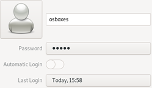

Victim host interactive login screen. Useful to correlate interactive sessions with timeline events.  

Snapshot of system settings and product activation details used for baseline documentation.  
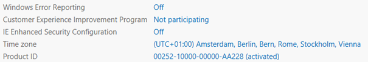

### Network discovery and exposure

Target host IP address and interface details used for connectivity verification.  
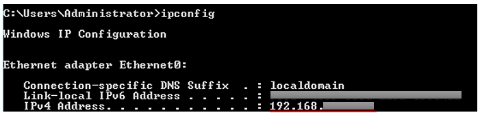

Attacker host IP configuration used for routing and file transfer validation.  
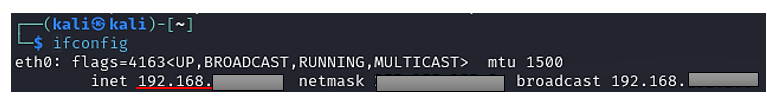

Utility host interface details used during file handling and conversion steps.  
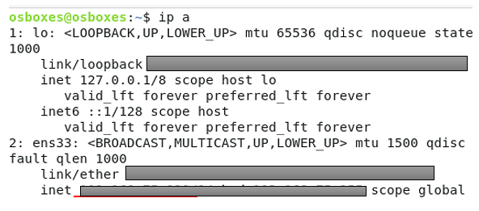

Shows a vulnerability script result indicating exposure of a legacy SMB weakness; demonstrates why patching and inventory are critical.  
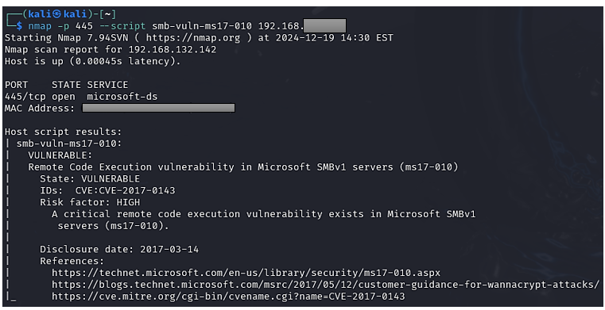

Service fingerprinting output used to build the attack surface map.  
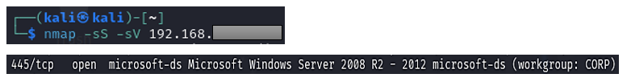

### Compromise and session

Attacker framework start; in production such tool usage may trigger EDR detections.  
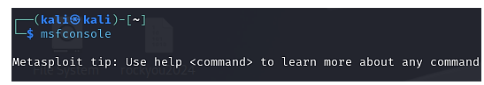

High level exploit output showing session creation in the lab. (No exploit commands included).  
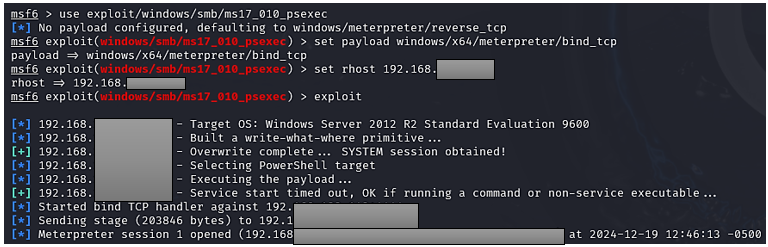

Interactive session opened; defenders should monitor for unusual shell spawn and lateral movement attempts.  
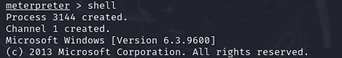

Confirmation of privilege context observed by the attacker (SYSTEM in the lab scenario).  
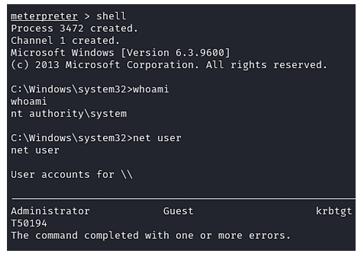

Collected host metadata: OS version, architecture and domain details used to prioritise response.  
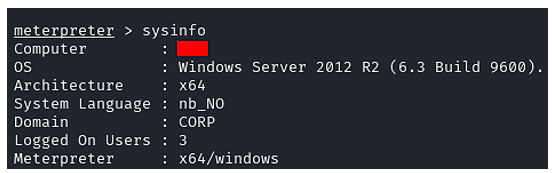

### Host capture and evidence handling

Host side trace started to capture network activity for forensic analysis.  
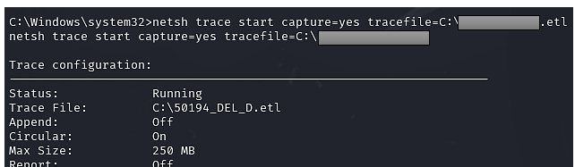

Verification that host tracing is active and recording to the expected file.  
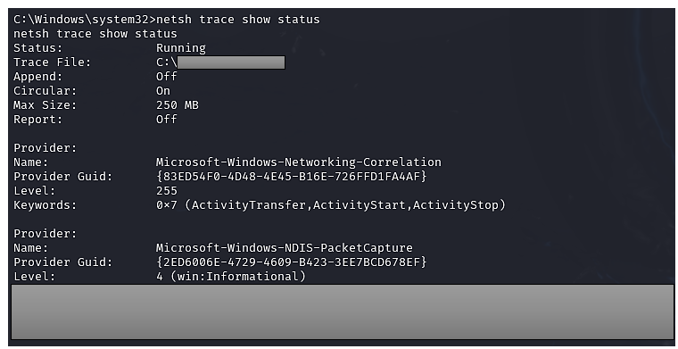

Provider and level information indicating what subsystems were traced.  
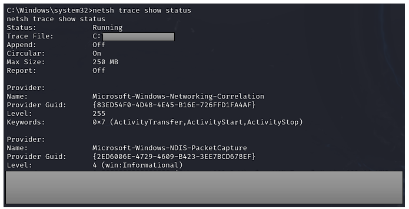

Trace session stopped and ETL file persisted to disk.  
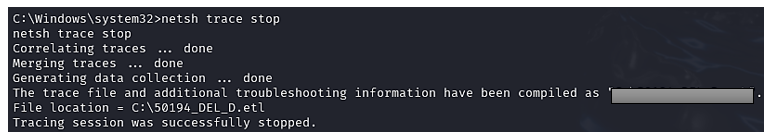

Temporary files observed on the victim prior to cleanup; monitor temp locations for staging.  
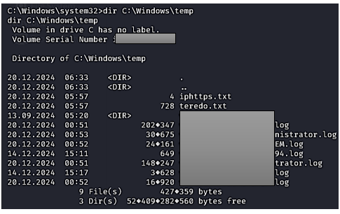

Example of attacker cleanup activity. Alerts for bulk deletions and unusual cleanup scripts can indicate tampering.  
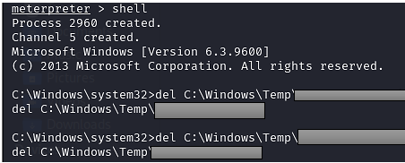

### Trace conversion and network analysis

ETL file transferred to the analysis host and visible in the file manager.  
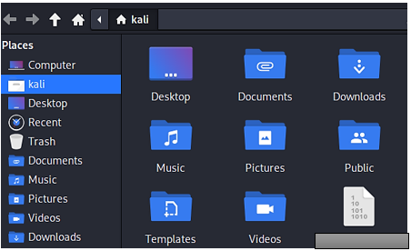

Interaction showing retrieval of the ETL from the victim to the analyst host.  
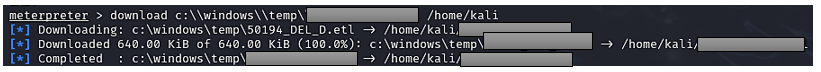

Workspace organization for conversion tasks and captured artefacts.  
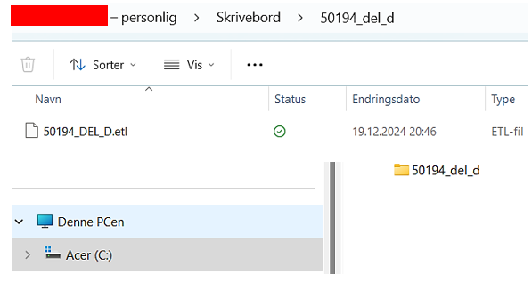

Utility used to convert ETL traces to PCAPNG format for Wireshark analysis.  
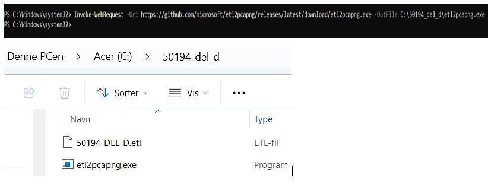

Conversion output confirming frames were written to the PCAPNG file.  

Movement of capture files between hosts; monitor and restrict cross-segment transfers.  
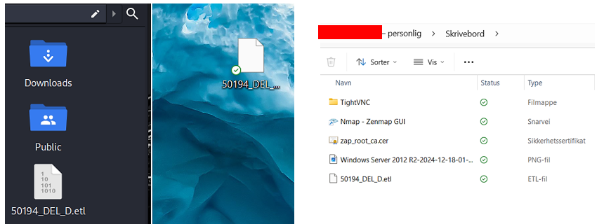

Filtered list of HTTP requests used to quickly identify POSTs and form submissions.  
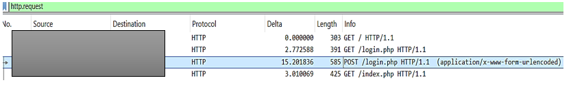

Captured HTTP POST body containing application credentials in the lab capture. This shows why TLS and secure session handling are essential.  
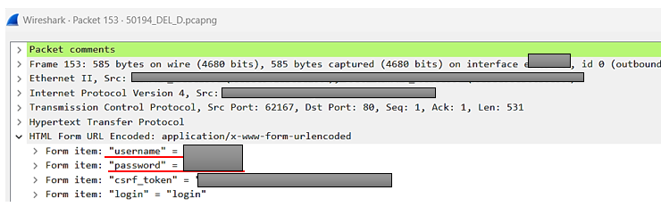

---

## Defensive recommendations

- **Patch and inventory**: Remove or isolate legacy services and ensure timely patching of high risk vulnerabilities.  
- **Network segmentation**: Limit lateral movement and reduce exposure of management services.  
- **Endpoint telemetry**: Collect process, command line and file activity; alert on suspicious shells and rapid file transfers.  
- **Network monitoring**: Capture and retain relevant packet captures or ETW traces for forensic validation; alert on plaintext credential transmissions.  
- **Least privilege and credential hygiene**: Reduce administrative exposure and enforce multi factor authentication for privileged accounts.  
- **Secure development**: Ensure applications validate and encode user input, enforce HTTPS and use secure cookie attributes.

## References

- OWASP — Cross Site Scripting Prevention Cheat Sheet  
- Microsoft — Event Tracing for Windows (ETW) documentation  
- Wireshark — User guide and HTTP analysis

## Contact

For questions or collaboration, please reach out.

Created by Mahamed Maki Saine – Cybersecurity | Ethical Hacker | AI Learner

